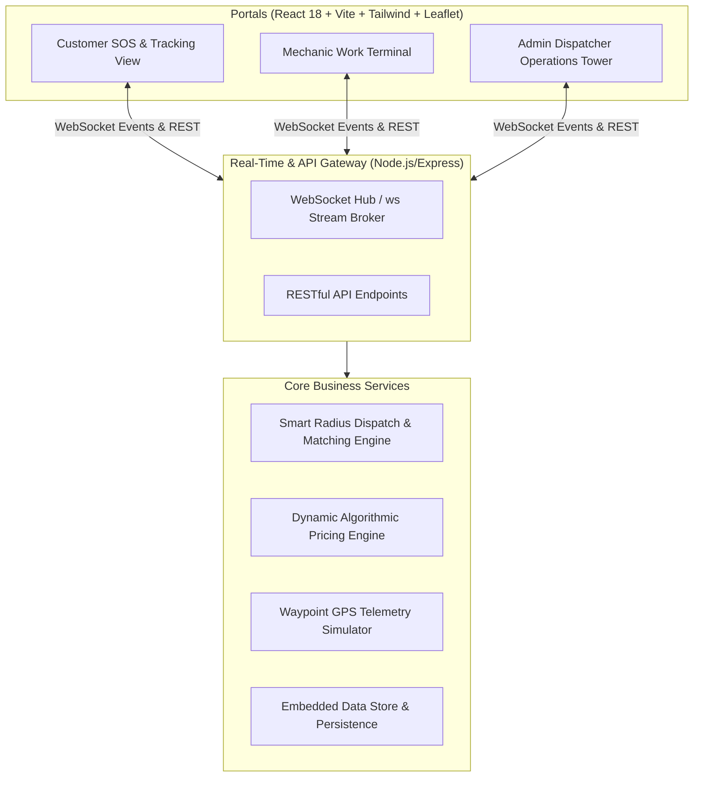

# 🚗 ResQAuto — Real-Time Emergency Roadside Assistance & Verified Mechanic Dispatch Platform

**ResQAuto** is a production-grade, full-stack on-demand roadside assistance and verified mechanic dispatching platform designed to help vehicle owners during emergency breakdowns (punctures, battery jumpstarts, towing, lockouts, mechanical diagnostics, fuel delivery, and post-repair drop-off).

The platform pairs high-anxiety drivers with nearby vetted master mechanics with transparent algorithmic pricing, live GPS telemetry tracking, and operational control.

---

## 🏗️ System Architecture



---

## 🌟 Key Features

### 1. 🚗 Customer SOS Portal
- **Emergency Triage Wizard**: 3-step intuitive wizard to request assistance:
  - Select breakdown issue (Puncture, Battery, Towing, Lockout, Diagnostic, Fuel, Brake, Drop-Off).
  - Specify vehicle category (Sedan, SUV, EV/Hybrid, Heavy Truck, Motorcycle).
  - Instant transparent price breakdown before confirming dispatch.
- **Live GPS Map Tracking**:
  - Interactive Leaflet map featuring animated mechanic approach marker, breakdown pinpoint, and polyline route.
  - Live distance ticker and dynamic ETA countdown.
  - 5-stage status stepper: *SOS Broadcast* $\rightarrow$ *En Route* $\rightarrow$ *Arrived* $\rightarrow$ *Triage & Repair* $\rightarrow$ *Resolved*.
- **Live In-App Chat & Call Simulator**: Directly communicate with your assigned technician.
- **Post-Repair Vehicle Drop-Off**: Option to have your vehicle delivered back to your home or office after garage repairs.
- **Dynamic Digital Invoice & Reviews**: Itemized receipt reflecting on-site parts added in real time, plus a 5-star rating system.

### 2. 🔧 Mechanic Work Terminal
- **Visual & Audio Radar Alerts**: Synthesized Web Audio API radar ping and 30-second countdown for incoming matched jobs.
- **Online / Busy / Offline Toggle**: Manage on-duty availability.
- **Turn-by-Turn Navigation Simulator**: Telemetry simulator advances coordinates towards breakdown destination.
- **Digital Job Sheet & Parts Adder**:
  - Check-in upon arrival.
  - Add replacement parts and shop supplies dynamically (e.g., 12V AGM Battery, Patch Kit), updating customer bill live.
- **Earnings & Rescue History**: Real-time ledger of completed jobs and total payouts.

### 3. 🛡️ Admin & Dispatcher Control Tower (God View)
- **Metropolitan Fleet Map**: Leaflet view displaying all active mechanics (color-coded by status) and blinking emergency SOS breakdown spots.
- **Emergency Incidents Queue**: Overview of all active and past rescues.
- **Manual Dispatch Override**: Dispatchers can override automated matching and manually assign any incident.
- **Mechanic Vetting & KYC Pipeline**: One-click verification and revocation of licenses, ASE/AAA credentials, and commercial insurance.
- **SLA & Revenue Analytics**: Metrics tracking active emergencies, fleet availability, average response SLA, and revenue volume.

---

## 💻 Tech Stack

- **Backend**: Node.js, Express, WebSockets (`ws`), TypeScript, Zod, Embedded JSON/ACID store.
- **Frontend**: React 18, Vite, TypeScript, Tailwind CSS, Lucide Icons, Leaflet.
- **Algorithms**:
  - **Haversine Proximity Matcher**: $d = 2R \arcsin\left(\sqrt{\sin^2(\frac{\Delta \phi}{2}) + \cos \phi_1 \cos \phi_2 \sin^2(\frac{\Delta \lambda}{2})}\right)$
  - **Dispatch Scoring**: Weighs distance ($0.7\times$), rating ($-1.5\times$), and technician years of experience.
  - **Dynamic Rate Card**: Base fare $\times$ Vehicle class multiplier + Billable distance transit + Emergency surge + Parts + Drop-off add-on.
  - **GPS Waypoint Interpolator**: Realistic telemetric progression along curved coordinates with live ETA updates.

---

## 🚀 Quick Start & Running Locally

### Prerequisites
- **Node.js**: v18 or higher (v26 verified)
- **npm**: v9 or higher

### Option 1: Run Full-Stack Concurrently (Recommended)

From the project root (`resqauto-platform`):

```bash
# In terminal 1: Start Backend Server (Port 5000)
cd server
npm start

# In terminal 2: Start Frontend Client (Port 3000)
cd client
npm run dev
```

Open your browser at **`http://localhost:3000`**.

---

## 🧪 Interactive Walkthrough & Testing

1. **Open Customer SOS View**:
   - In the top navigation bar, ensure **Customer SOS** is active.
   - Click the pulsing red **SOS Emergency** button.
   - Choose **Flat Tire & Puncture**, select **SUV**, and review the upfront guaranteed price breakdown.
   - Click **Confirm & Dispatch Verified Mechanic**.

2. **Watch the Dispatch & Switch to Mechanic Terminal**:
   - The system automatically matches the closest verified technician (e.g. Marcus Vance with his Heavy Duty Tow unit).
   - In the top bar, switch to **Mechanic View** (Active Unit: *Marcus Vance*).
   - See the incoming job broadcast alert with 30s countdown and click **Accept & Mobilize**.

3. **Live Telemetry & On-Site Diagnostics**:
   - Notice the status updates to **En Route**.
   - As the vehicle moves along simulated waypoints, switch between **Customer SOS** and **Mechanic View** to observe both screens updating simultaneously in real time.
   - On the mechanic screen, click **Confirm Arrival at Scene**, then **Start Diagnostics & Repair**.
   - Click **+ Add Parts / Supplies**, pick *Radial Tire Patch & Plug Kit ($35)*, and add it to the work order.
   - Verify that the customer screen instantly updates its live itemized bill!

4. **Completion, Digital Invoicing & Admin God View**:
   - On the mechanic screen, click **Complete Repair & Finalize Bill**, then **Release Vehicle & Complete Job**.
   - On the customer screen, click **View Receipt & Rate Technician**, rate 5 stars, and confirm payment.
   - Switch to **Admin Tower** in the top bar to inspect the fleet map, review the completed incident, and inspect the vetting portal.